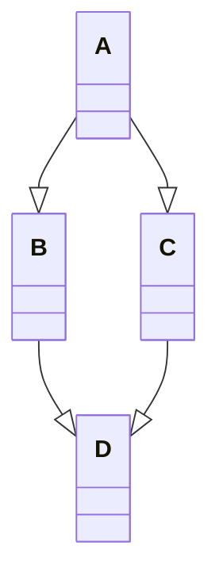

Inheritance in C++

Inheritance in C++
Як ми знаємо у мові С++ є як одинарне наслідування так і множинне. Це дає як певні переваги так і недоліки.
Було досліджено проблему «Ромбове наслідування». І виведено рішення проблеми.
Отже, суть проблеми наступна: 
	

Наприклад в класі А є віртуальна функція «print» і в класах В і С вона визначається. Клас D є наслідником класів А і В. Відповідно кожен клас містить визначення функції «print». Перевіряючи на Visual Studio ми побачили помилку: «"D::print" is ambiguous». Код запустити не вдалося. 
Відповідно рішення проблеми доволі просте. При виклику функції «print» через об’єкт класу D Ви повинні вказати з якого саме базового класу потрібно виконувати функцію:
«d->C::print();», «d->B::print();».
